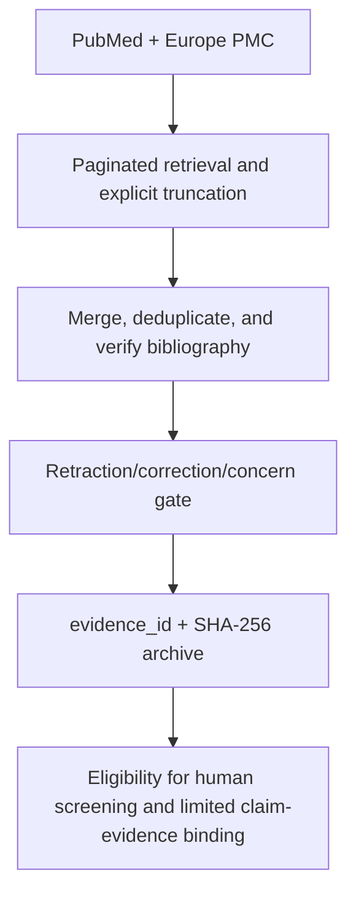

# Paper AI Research Agent

<p align="center">
  <a href="README.md">简体中文</a> · <a href="README.en.md">English</a>
</p>

<p align="center">
  
</p>

<p align="center">
  <strong>Open-literature discovery, auditable evidence states, and fail-closed critical gates.</strong>
</p>

<p align="center">
  <a href="https://github.com/TUANZIDING/Paper-AI-Research-Agent/actions/workflows/ci.yml"></a>
  
  
  <a href="LICENSE"></a>
</p>

Paper AI Research Agent is a local, deterministic literature-retrieval core built on
open scholarly APIs. It separates discovery, bibliographic verification,
post-publication status checks, evidence preservation, and human screening into
auditable stages.

> [!IMPORTANT]
> This project does not bypass paywalls, authentication, robots.txt rules, or
> institutional access. It is not equivalent to Embase, Scopus, or Web of Science.
> `citation_ready=true` does not mean that a paper has been read, that its conclusions
> are reliable, or that a systematic-review search is complete.

## Workflow



Plain-text sequence: open sources → paginated retrieval → merge and verification →
post-publication gate → hashed evidence archive → human screening.

## Capability status

| Status | Capability | Exact boundary |
|---|---|---|
| Implemented | PubMed and Europe PMC retrieval with pagination state | Explicitly reports `complete`, `truncated`, or `partial` |
| Implemented | DOI/PMID/title deduplication and NCBI/Crossref verification | Metadata conflicts fail closed |
| Implemented | Crossref and PubMed post-publication gate | Risk signals or incomplete checks block citation candidates |
| Implemented | Raw-response archive, `evidence_id`, SHA-256, and `verify-run` | Checks files against the current manifest |
| Implemented | Content-addressed SQLite cache and strict offline replay | Missing cache entries never fall back to the network |
| Limited | Numbered-PDF reference extraction and body-citation location mapping | Requires a heading and continuous `[1]..[n]`; location is not semantic support |
| Limited | License/location candidates and policy-gated public full-text fetcher | A candidate is not legal clearance; explicit license, version, and all safety gates are required |
| Limited | Crossref status fallback | `crossmark_realtime_verified=false`; not a live Crossmark verification |
| Limited | Quote/paragraph binding in hashed UTF-8 or JATS text | A location match is not semantic support or `claim_verified` |
| External gate required | Real identity, actual human reading, and final legal approval | Ed25519 proves control of the supplied key only |
| External gate required | 200+ independently human-adjudicated gold cases | The current 240 cases are synthetic contract/adversarial cases with `human_adjudicated=false` |

See [Acceptance Gates](docs/ACCEPTANCE_GATES.md) for the full contract.

## Quick start

Python 3.10+ is required. The network/audit core uses the standard library; PDF text extraction uses `pypdf`, installed with the project.

```bash
python3 -m venv .venv
. .venv/bin/activate
python3 -m pip install -e .

research-agent search '"diabetic osteoporosis" AND osteoblast' --limit 10
```

By default, each search writes to a dedicated, non-overwriting run directory containing:

```text
runs/<UTC-time>-<query>/
├── manifest.json
├── records.jsonl
├── report.md
└── raw_responses/
```

Verify a run:

```bash
research-agent verify-run /absolute/path/to/run-directory
```

Reverse-audit a local PDF (local extraction only by default):

```bash
research-agent audit-pdf-references /absolute/path/to/article.pdf \
  --output /absolute/path/to/pdf-audits

# Network lookup is explicit; raw PubMed/Europe PMC responses are archived
research-agent audit-pdf-references /absolute/path/to/article.pdf \
  --lookup --cache-db /absolute/path/to/http-cache.sqlite3 \
  --output /absolute/path/to/pdf-audits

# A bounded live lookup can target difficult entries first
research-agent audit-pdf-references /absolute/path/to/article.pdf \
  --lookup --lookup-references 1,46,59 --limit-per-reference 5
```

Artifacts bind the PDF hash to parsed references, page/context citation locations,
candidate scores, raw API bytes, and a manifest. Automated output retains
`semantic_support_status=NOT_ASSESSED` and `human_adjudicated=false`; see the
[PDF reference-audit boundary](docs/PDF_REFERENCE_AUDIT.md).

Strict offline replay:

```bash
research-agent search 'YOUR QUERY' --limit 10 \
  --cache-db /absolute/path/to/http-cache.sqlite3 \
  --output /absolute/path/to/online-runs

research-agent search 'YOUR QUERY' --limit 10 \
  --cache-db /absolute/path/to/http-cache.sqlite3 \
  --offline-replay \
  --output /absolute/path/to/replay-runs
```

License-candidate discovery and policy-gated full text:

```bash
research-agent discover-licenses --crossref /absolute/path/to/crossref.json

research-agent download-fulltext \
  --url 'https://repository.example/article.xml' \
  --license 'CC BY 4.0' \
  --version publishedVersion \
  --output /absolute/path/to/article.xml
```

The fetcher checks a conservative license allowlist, manuscript version, HTTPS,
DNS/IP and SSRF constraints, same-origin redirects, robots policy, wall-clock timeout,
size, PDF/JATS XML structure, and atomic persistence. PDF validation also requires
local `pdfinfo`. Any failed gate stops the operation.

## Trust model

- Abstracts, full text, webpages, attachments, and remote metadata remain untrusted inputs.
- `citation_ready` means eligible for human screening—nothing more.
- `unknown` is never rewritten as safe or not retracted.
- License discovery produces candidates, not final legal opinions.
- A claim location does not prove scientific truth or semantic entailment.
- A self-attestation hash chain does not prove identity; a signature proves key control only.
- Coverage from open scholarly sources is not equivalent to commercial-database coverage or a complete systematic-review search.

## Verification

```bash
PYTHONPATH=src python3 -m unittest discover -s tests -v
python3 scripts/verify_release.py
python3 -m compileall -q src scripts tests
```

Snapshot on 2026-07-26: use the current CI output for the test count; six golden seeds and
240 deterministic synthetic contract/adversarial cases. The latter are not an
independently human-adjudicated gold set.

## Not yet completed

1. Final legal/policy judgment and cross-jurisdiction approval for license candidates;
2. broader publisher formats and public-network full-text acceptance testing;
3. controlled OCR/table/figure and full-text semantic claim-evidence derivation;
4. 200+ real difficult cases with independent human labeling and adjudication;
5. real external human reading, identity, independence, consent, and approval;
6. automatic version graphs for preprints, accepted manuscripts, versions of record, and corrections;
7. interrupted-pagination resume, partial-page recovery, run comparison, and an independent live Crossmark provider.

## Documentation (currently Chinese)

- [Source and legal boundaries](docs/SOURCE_POLICY.md)
- [Acceptance gates](docs/ACCEPTANCE_GATES.md)
- [Roadmap](docs/ROADMAP.md)
- [Claim–Evidence location binding](docs/CLAIM_EVIDENCE.md)
- [PDF reference-audit boundary](docs/PDF_REFERENCE_AUDIT.md)
- [Crossmark fallback policy](docs/CROSSMARK_POLICY.md)
- [Human review, identity, and legal gates](docs/HUMAN_AND_LEGAL_GATES.md)
- [Hero asset provenance and boundaries](docs/ASSET_PROVENANCE.md)

## License

[MIT](LICENSE). Article full text, remote metadata, and third-party materials remain
subject to their respective original terms.
