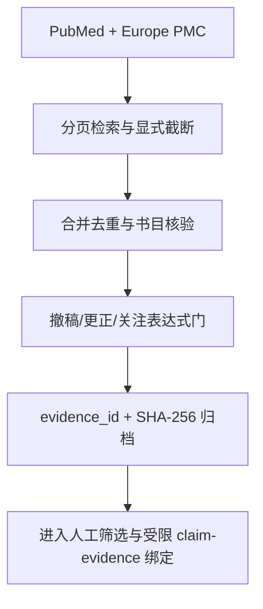

# Paper AI Research Agent

<p align="center">
  <a href="README.md">简体中文</a> · <a href="README.en.md">English</a>
</p>

<p align="center">
  
</p>

<p align="center">
  <strong>开放文献发现，证据状态可审计，关键门槛失败关闭。</strong>
</p>

<p align="center">
  <a href="https://github.com/TUANZIDING/Paper-AI-Research-Agent/actions/workflows/ci.yml"></a>
  
  
  <a href="LICENSE"></a>
</p>

Paper AI Research Agent 是一个基于开放学术 API 的本地、确定性文献检索内核。
它把“找到论文”“核对书目”“检查出版后状态”“保存证据”和“进入人工筛选”
拆成可审计的独立步骤。

> [!IMPORTANT]
> 本项目不绕过付费墙、登录、robots 或机构权限；不等价替代 Embase、Scopus、
> Web of Science；`citation_ready=true` 也不代表已阅读全文、研究结论可靠或系统综述检索完整。

## 工作流



纯文本顺序：开放来源 → 分页检索 → 合并与核验 → 出版后状态门 → 哈希证据归档 → 人工筛选。

## 能力状态

| 状态 | 能力 | 准确边界 |
|---|---|---|
| 已实现 | PubMed、Europe PMC 检索与完整分页状态 | 显式报告 `complete`、`truncated` 或 `partial` |
| 已实现 | DOI/PMID/题名去重与 NCBI/Crossref 书目核验 | 元数据冲突失败关闭 |
| 已实现 | Crossref 与 PubMed 出版后状态门 | 风险信号或查询不完整会阻断引用候选 |
| 已实现 | 原始响应存档、`evidence_id`、SHA-256、`verify-run` | 验证当前 manifest 与文件一致性 |
| 已实现 | SQLite 内容寻址缓存与严格离线回放 | 缓存缺失不会联网回退 |
| 受限实现 | 编号制 PDF 参考文献提取与正文引用位置映射 | 仅支持明确标题和连续 `[1]..[n]`；位置不等于语义支持 |
| 受限实现 | 许可证/全文位置候选与策略门控的公开全文下载 | 候选不是法律授权；需白名单许可证、已知版本及全部安全门 |
| 受限实现 | Crossref 状态补充 fallback | `crossmark_realtime_verified=false`，不是实时 Crossmark 核验 |
| 受限实现 | 已哈希 UTF-8/JATS 文本的 quote/paragraph 位置绑定 | 位置命中不等于语义支持或 `claim_verified` |
| 外部门未完成 | 现实身份、实际人工核读、最终法律批准 | Ed25519 仅证明给定密钥控制 |
| 外部门未完成 | 200+ 独立人工裁决黄金集 | 现有 240 条是合成契约/对抗用例，`human_adjudicated=false` |

完整门槛见 [分阶段验收门](docs/ACCEPTANCE_GATES.md)。

## 快速开始

要求 Python 3.10+。网络与审计内核使用标准库，PDF 文本提取使用 `pypdf`，安装项目时会自动安装。

```bash
python3 -m venv .venv
. .venv/bin/activate
python3 -m pip install -e .

research-agent search '"diabetic osteoporosis" AND osteoblast' --limit 10
```

每次检索写入独立、不覆盖的目录；默认存档模式包含：

```text
runs/<UTC时间>-<查询词>/
├── manifest.json
├── records.jsonl
├── report.md
└── raw_responses/
```

核验一次运行：

```bash
research-agent verify-run /absolute/path/to/run-directory
```

逆向审计一篇本地 PDF（默认仅解析，不联网）：

```bash
research-agent audit-pdf-references /absolute/path/to/article.pdf \
  --output /absolute/path/to/pdf-audits

# 明确允许后，才逐条查询 PubMed 与 Europe PMC，并归档远端原始响应
research-agent audit-pdf-references /absolute/path/to/article.pdf \
  --lookup --cache-db /absolute/path/to/http-cache.sqlite3 \
  --output /absolute/path/to/pdf-audits

# 可先对困难条目做小批量真实查询
research-agent audit-pdf-references /absolute/path/to/article.pdf \
  --lookup --lookup-references 1,46,59 --limit-per-reference 5
```

产物包含 PDF 哈希、结构化参考文献、正文引用页码/短上下文及哈希、候选匹配分数、
原始 API 响应和 manifest。自动结果始终保留
`semantic_support_status=NOT_ASSESSED`、`human_adjudicated=false`；详见
[PDF 参考文献审计边界](docs/PDF_REFERENCE_AUDIT.md)。

严格离线回放：

```bash
research-agent search 'YOUR QUERY' --limit 10 \
  --cache-db /absolute/path/to/http-cache.sqlite3 \
  --output /absolute/path/to/online-runs

research-agent search 'YOUR QUERY' --limit 10 \
  --cache-db /absolute/path/to/http-cache.sqlite3 \
  --offline-replay \
  --output /absolute/path/to/replay-runs
```

许可证候选与安全全文命令：

```bash
research-agent discover-licenses --crossref /absolute/path/to/crossref.json

research-agent download-fulltext \
  --url 'https://repository.example/article.xml' \
  --license 'CC BY 4.0' \
  --version publishedVersion \
  --output /absolute/path/to/article.xml
```

下载器会检查许可证白名单、稿件版本、HTTPS、DNS/IP、SSRF、同源重定向、
robots、总时限、大小、PDF/JATS XML 结构及原子落盘。PDF 还需要本机 `pdfinfo`；
任一门不满足即停止。

## 信任模型

- 摘要、全文、网页、附件和远端元数据始终按不可信输入处理。
- `citation_ready` 只表示可进入下一步人工筛选。
- `unknown` 不会被改写为“安全”或“已排除撤稿”。
- 许可证发现只生成候选，不提供最终法律意见。
- claim 的位置绑定不证明科学结论真实，也不证明语义蕴含。
- 自我声明哈希链不证明现实身份；外部签名只证明密钥控制。
- 开放源覆盖不等于商业数据库覆盖或系统综述无遗漏。

## 验证

```bash
PYTHONPATH=src python3 -m unittest discover -s tests -v
python3 scripts/verify_release.py
python3 -m compileall -q src scripts tests
```

2026-07-26 快照：测试数以当前 CI 输出为准；6 条 golden seed；另有 240 条
确定性合成契约/对抗用例。后者不是独立人工裁决黄金集。

## 尚未完成

1. 许可证候选的最终法律/政策判断与跨法域批准；
2. 更广发布商格式和可控公网环境的全文下载验收；
3. OCR、表格、图片和全文语义的受控 claim-evidence 派生链；
4. 200+ 真实困难样本及独立人工标注/裁决；
5. 外部真实人工核读、现实身份、专业独立性、同意和审批；
6. 预印本、接受稿、正式版与更正稿版本图自动生产；
7. 中断分页续传、部分页恢复、检索批次比较和独立实时 Crossmark 提供方。

## 文档

- [数据源与合法边界](docs/SOURCE_POLICY.md)
- [分阶段验收门](docs/ACCEPTANCE_GATES.md)
- [实施路线](docs/ROADMAP.md)
- [Claim–Evidence 位置绑定](docs/CLAIM_EVIDENCE.md)
- [PDF 参考文献审计边界](docs/PDF_REFERENCE_AUDIT.md)
- [Crossmark 补充覆盖政策](docs/CROSSMARK_POLICY.md)
- [人工核读、身份与法律判断边界](docs/HUMAN_AND_LEGAL_GATES.md)
- [主视觉来源与使用边界](docs/ASSET_PROVENANCE.md)

## 许可证

[MIT](LICENSE)。论文全文、远端元数据和第三方内容仍分别受其原始条款约束。
